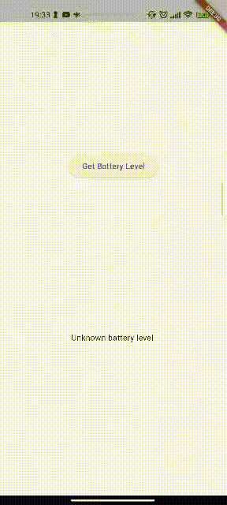
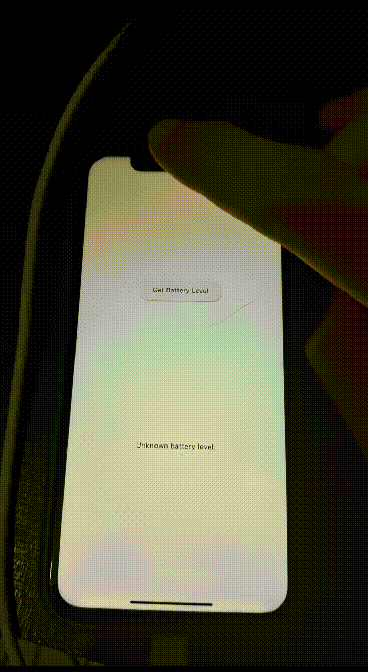

### Flutter `Platform Channels` em ação: comunicação eficiente entre Flutter, Kotlin e Swift para monitorar o nível de bateria em aplicações móveis".  

Utilizando PlatformChannels para recuperar o nível da bateria, comunicando Flutter <> Kotlin e Flutter <> Swift.  
### O que é Platform Channels em flutter ?
O Platform Channel no Flutter é um mecanismo que permite a comunicação bidirecional entre código Dart (usado no Flutter) e código nativo, que pode ser escrito em Kotlin/Java para Android ou Swift/Object-c para iOS, mas isso vale também para o restante das plataformas como web, macOS, windows. Ele permite que o Flutter chame métodos definidos no código nativo e vice-versa. Essa comunicação é útil para integrar funcionalidades específicas da plataforma ou acessar APIs nativas que não estão diretamente disponíveis no Flutter. Em resumo, o Platform Channel facilita a interação harmoniosa entre o mundo Dart do Flutter e o código nativo das plataformas suportadas pelo Flutter.  

Aqui usaremos Swift e Kotlin para exemplificar.  
### Começando
Crie um novo projeto  
`flutter create platform_channels_battery`  

### Hora da mão na massa
Encontre sua classe MainActivity.kt na seguinte estrutura de pastas:
```dart
- platform_channels_battery //project folder
 - android
  - app
   - src
    - main
     - kotlin/com/example/platform_channels_battery
      - MainActivity.kt                       
```  
Você deve encontrar algo como:

```kotlin
package com.example.app

import io.flutter.embedding.android.FlutterActivity
import androidx.annotation.NonNull
import io.flutter.embedding.android.FlutterFragmentActivity
import io.flutter.embedding.engine.FlutterEngine
import io.flutter.plugins.GeneratedPluginRegistrant

class MainActivity: FlutterFragmentActivity() 
  {
    override fun configureFlutterEngine(@NonNull flutterEngine: FlutterEngine) 
      {
        GeneratedPluginRegistrant.registerWith(flutterEngine) 
      }
  }
```  
Com a classe aberta vamos fazer as seguintes alterações:
Dentro do configureFlutterEngine()método, crie um MethodChannele chame setMethodCallHandler(). Certifique-se de usar o mesmo nome de canal usado no lado do cliente Flutter. 
```kotlin
import androidx.annotation.NonNull
import io.flutter.embedding.android.FlutterActivity
import io.flutter.embedding.engine.FlutterEngine
import io.flutter.plugin.common.MethodChannel

class MainActivity: FlutterActivity() {

private val CHANNEL = "samples.flutter.dev/battery"
    /**
    * Configura o mecanismo FlutterEngine para suportar a comunicação entre o código Dart e o código nativo (Kotlin/Java).
    * Um canal de comunicação é criado com o nome "samples.flutter.dev/battery".
    * O método setMethodCallHandler é utilizado para definir um manipulador de chamadas de método, onde o código nativo
    * responde às mensagens enviadas pelo Dart. Neste caso, o código nativo responde à chamada do método "getBatteryLevel".
    * Se a mensagem for reconhecida, o nível da bateria é retornado com sucesso para o Dart; caso contrário, um erro é enviado de volta.
    */
    override fun configureFlutterEngine(@NonNull flutterEngine: FlutterEngine) {
        super.configureFlutterEngine(flutterEngine)
         // Cria um canal de comunicação entre o código Dart e o código nativo (Kotlin/Java).
        // O nome do canal é "samples.flutter.dev/battery".
        MethodChannel(flutterEngine.dartExecutor.binaryMessenger, CHANNEL).setMethodCallHandler { call, result ->
             // Este bloco de código é chamado quando o Dart envia uma mensagem para o canal.
            // Verifica se a mensagem do Dart é para obter o nível da bateria.
            if (call.method == "getBatteryLevel") {
                val batteryLevel = getBatteryLevel()

                if (batteryLevel != -1) {
                    result.success(batteryLevel)
                } else {
                    // Se não for bem-sucedido, envia um erro de volta para o Dart.
                    result.error("UNAVAILABLE", "Battery level not available.", null)
                }
            } else {
              // Se a mensagem do Dart não for reconhecida, informa que não foi implementada.
                result.notImplemented()
            }
        }
    }

}
```  
A função configureFlutterEngine estabelece um canal de comunicação entre o código Flutter e o código nativo (Kotlin/Java) por meio do MethodChannel. Esse canal permite chamadas bidirecionais, permitindo que o Flutter solicite e receba informações específicas da plataforma nativa, como o nível da bateria, facilitando a integração de recursos nativos em aplicativos Flutter.
Agora Vamos adicionar o restante das importações necessárias  
```kotlin
import android.content.Context
import android.content.ContextWrapper
import android.content.Intent
import android.content.IntentFilter
import android.os.BatteryManager
import android.os.Build.VERSION
import android.os.Build.VERSION_CODES
```  
### Função para recuperação do nível de bateria
```kotlin
    // Função para obter o nível da bateria.
    private fun getBatteryLevel(): Int {
        // Declara uma variável para armazenar o nível da bateria.
        val batteryLevel: Int
        // Verifica a versão do Android para escolher o método 
        // adequado para obter o nível da bateria.
        if (VERSION.SDK_INT >= VERSION_CODES.LOLLIPOP) {
            // Se a versão for igual ou superior ao Android Lollipop, usa a API BatteryManager.
            val batteryManager = getSystemService(Context.BATTERY_SERVICE) as BatteryManager
            batteryLevel = batteryManager.getIntProperty(BatteryManager.BATTERY_PROPERTY_CAPACITY)
        } else {
            // Se a versão for inferior ao Android Lollipop, usa a Intent ACTION_BATTERY_CHANGED.
            val intent = ContextWrapper(applicationContext).registerReceiver(null, IntentFilter(Intent.ACTION_BATTERY_CHANGED))
            batteryLevel = intent!!.getIntExtra(BatteryManager.EXTRA_LEVEL, -1) * 100 / intent.getIntExtra(BatteryManager.EXTRA_SCALE, -1)
        }
        // Retorna o nível da bateria.
        return batteryLevel
    }
```  
Esta função, `getBatteryLevel()`, retorna o nível da bateria do dispositivo Android. Utiliza métodos diferentes com base na versão do sistema operacional: se Lollipop (Android 5.0) ou superior, utiliza a API BatteryManager; caso contrário, utiliza a Intent `ACTION_BATTERY_CHANGED`. O objetivo é fornecer uma maneira eficaz de obter informações sobre o nível da bateria, adaptando-se dinamicamente às versões do Android para garantir precisão nos dados coletados.  
E agora você deve conseguir executar o aplicativo no Android. Se estiver usando o Android Emulator, defina o nível da bateria no painel Extended Controls acessível a partir do botão na barra de ferramentas.  
Antes de partimos para a implementação em Swift vamos criar nossa tela bem rápido para visualização.  
`Em seu arquivo main.dart`  
Vamos criar uma page bem simples, com um botão e um text.
```dart
import 'package:flutter/material.dart';
import 'package:flutter/services.dart';

void main() {
  runApp(const MyApp());
}

class MyApp extends StatelessWidget {
  const MyApp({super.key});

  // This widget is the root of your application.
  @override
  Widget build(BuildContext context) {
    return MaterialApp(
      title: 'Platform Channels',
      theme: ThemeData(
        colorScheme: ColorScheme.fromSeed(seedColor: Colors.deepPurple),
        useMaterial3: true,
      ),
      home: const MyHomePage(title: 'Platform Channels'),
    );
  }
}

class MyHomePage extends StatefulWidget {
  const MyHomePage({super.key, required this.title});

  final String title;

  @override
  State<MyHomePage> createState() => _MyHomePageState();
}

class _MyHomePageState extends State<MyHomePage> {
  
  // Cria uma instância constante de MethodChannel chamada 'platform'
  // para estabelecer um canal de comunicação com o código nativo,
  // usando o identificador 'samples.flutter.dev/battery'.
  static const platform = MethodChannel('samples.flutter.dev/battery');
  // Recupera o nivel de bateria.
  String _batteryLevel = 'Unknown battery level.';
  // Função assíncrona para obter o nível da bateria.
  Future<void> _getBatteryLevel() async {
    String batteryLevel;
    try {
      // Invoca o método 'getBatteryLevel' no canal 'platform' e aguarda o resultado.
      final result = await platform.invokeMethod<int>('getBatteryLevel');
      // Atualiza a string com o nível da bateria obtido.
      batteryLevel = 'Battery level at $result % .';
    } on PlatformException catch (e) {
      // Em caso de falha, registra a mensagem de erro.
      batteryLevel = "Failed to get battery level: '${e.message}'.";
    }
    // Mudando estado do nosso text
    setState(() {
      _batteryLevel = batteryLevel;
    });
  }

  @override
  Widget build(BuildContext context) {
    return Material(
      child: Center(
        child: Column(
          mainAxisAlignment: MainAxisAlignment.spaceEvenly,
          children: [
            ElevatedButton(
              onPressed: _getBatteryLevel,
              child: const Text('Get Battery Level'),
            ),
            Text(_batteryLevel),
          ],
        ),
      ),
    );
  }
}
```
### Resultado no Android 
 

Partindo agora para a comunicação Flutter e Swift
Comece encontrando o arquivo AppDelegate.swift na seguinte estrutura de pastas:  
```swift
- platform_channels_battery //project folder
  - ios
    - Runner
      - AppDelegate.swift
```
Ao abri-lo irá encontrar algo como:  
```swift
import UIKit
import Flutter

@UIApplicationMain
@objc class AppDelegate: FlutterAppDelegate {
  override func application(
    _ application: UIApplication,
    didFinishLaunchingWithOptions launchOptions: [UIApplication.LaunchOptionsKey: Any]?
  ) -> Bool {
    GeneratedPluginRegistrant.register(with: self)
    return super.application(application, didFinishLaunchingWithOptions: launchOptions)
  }
}
```  
### Agora mão na massa
Vamos adicionar um techo de código e a explicação virá a seguir  
```swift
import UIKit
import Flutter

@UIApplicationMain
@objc class AppDelegate: FlutterAppDelegate {
  override func application(
    _ application: UIApplication,
    didFinishLaunchingWithOptions launchOptions: [UIApplication.LaunchOptionsKey: Any]?
  ) -> Bool {

    let controller : FlutterViewController = window?.rootViewController as! FlutterViewController
    let batteryChannel = FlutterMethodChannel(name: "samples.flutter.dev/battery",
                                              binaryMessenger: controller.binaryMessenger)
    batteryChannel.setMethodCallHandler({
      (call: FlutterMethodCall, result: @escaping FlutterResult) -> Void in
      // Adicionaremos um metodo aquiem breve
    })

    GeneratedPluginRegistrant.register(with: self)
    return super.application(application, didFinishLaunchingWithOptions: launchOptions)
  }
}
```
Atente-se para o código adicionado, pois adicionamos ele entre o inicio das chaves { e acima das duas ultimas linhas a seguir
`GeneratedPluginRegistrant.register(with: self)`
 `return super.application(application, didFinishLaunchingWithOptions: launchOptions)`
Este trecho de código em Swift permite a criação de um canal de comunicação entre o Flutter e o código nativo (Swift) utilizando o FlutterMethodChannel. Ao criar o canal denominado `"samples.flutter.dev/battery"`, é possível definir um bloco de código dentro de setMethodCallHandler, que será acionado quando o Flutter chamar métodos nesse canal. Isso possibilita a manipulação de mensagens específicas, como solicitações para obter o nível da bateria. O controller é utilizado para obter o binaryMessenger, facilitando a comunicação eficiente entre Flutter e Swift. Em resumo, esse código estabelece a infraestrutura para uma comunicação eficaz entre Flutter e Swift, permitindo a execução de operações específicas da plataforma nativa em uma aplicação Flutter.  
### Função para recuperar o nível da bateria
```swift
private func receiveBatteryLevel(result: FlutterResult) {
  let device = UIDevice.current
  device.isBatteryMonitoringEnabled = true
  if device.batteryState == UIDevice.BatteryState.unknown {
    result(FlutterError(code: "UNAVAILABLE",
                        message: "Battery level not available.",
                        details: nil))
  } else {
    result(Int(device.batteryLevel * 100))
  }
}
```  
Este trecho de código em Swift habilita o monitoramento do nível da bateria no dispositivo iOS. Utilizando UIDevice, verifica se o estado da bateria é desconhecido e retorna um erro ao Flutter caso seja o caso. Caso contrário, calcula e retorna o nível da bateria em percentagem multiplicando device.batteryLevel por 100 através da função receiveBatteryLevel, que é chamada com o resultado do canal Flutter.
Finalmente, vamos concluir nosso `setMethodCallHandler()` método adicionado anteriormente. Você precisa lidar com um método de plataforma única, `getBatteryLevel()` então teste isso no callargumento. A implementação deste método de plataforma chama o código iOS escrito na etapa anterior. Se um método desconhecido for chamado, informe-o.  
Vamos adicionar esse restante de código onde estão nossos comentários, e nossa classe ficará assim:
```swift
import UIKit
import Flutter

@UIApplicationMain
@objc class AppDelegate: FlutterAppDelegate {
  override func application(
    _ application: UIApplication,
    didFinishLaunchingWithOptions launchOptions: [UIApplication.LaunchOptionsKey: Any]?
  ) -> Bool {

    let controller : FlutterViewController = window?.rootViewController as! FlutterViewController
    let batteryChannel = FlutterMethodChannel(name: "samples.flutter.dev/battery",
                                              binaryMessenger: controller.binaryMessenger)
    batteryChannel.setMethodCallHandler({
      (call: FlutterMethodCall, result: @escaping FlutterResult) -> Void in
       // Este bloco de código é chamado quando o Dart envia uma mensagem para o canal.
         guard call.method == "getBatteryLevel" else {
         result(FlutterMethodNotImplemented)
         return
        }
        self.receiveBatteryLevel(result: result)

    })

    GeneratedPluginRegistrant.register(with: self)
    return super.application(application, didFinishLaunchingWithOptions: launchOptions)
  }
}
```
Este código em Swift dentro de um bloco `setMethodCallHandler` de um `FlutterMethodChannel` verifica se o método chamado pelo Flutter é `"getBatteryLevel"`. Se não for, retorna que o método não está implementado usando `FlutterMethodNotImplemented`. Se for, chama a função `receiveBatteryLevel` definida anteriormente no código, para obter e enviar de volta ao Flutter o nível da bateria do dispositivo iOS. O result é utilizado para retornar os resultados da chamada do método ao Flutter. O uso de `self` é uma precaução para evitar referências fortes e possíveis problemas de retenção de memória.

### Resultado no iOS
 
  
### Código fonte do projeto

[GitHub](https://github.com/kauemurakami/flutter_platform_channel_battery)  

Também contei com a ajuda do Luigi Gontijo, confira o [Github](https://github.com/gontijol) dele.

### Pronto
Agora que você aprendeu o básico do Flutter Platform Channels, tente explorar/aplicar em outras plataformas suportadas, o Platform Channels abre várias possibilidades para implementações que possuem uma especificidade, ou que ainda não existem packages flutter que suporte a função que deseja.
Basta ser criativo e poderá também substituir packages ou até mesmo criar os seus.  
### Fonte
Este artigo tem como base o mesmo projeto que pode ser encontrado aqui [flutterdev](https://docs.flutter.dev/platform-integration/platform-channels)